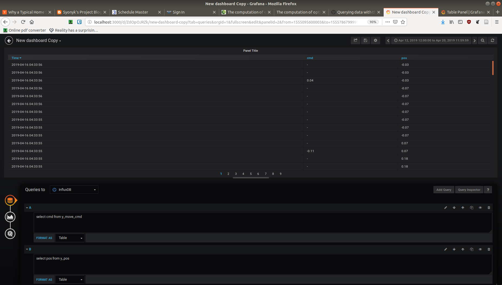

# RelativitySpaceHW

## Installation Instructions

Run './install.sh'

This installation assumes you are installing on a Linux system. 

Please do some manual setup of Grafana. 
Open up Grafana at http://localhost:3000/ and log in using default username/password: admin/admin. 
Set up Grafana to read from InfluxDB, with database 'robot\_sim" 
Create a new dashboard.   
Create the following queries:  
select pos from y\_pos 
select cmd from y\_move\_cmd 

Click the dropdown at the bottom of the query to change to "table" mode.  
Also go to the visualization tab in the far left and change from "graph" to "table".

## Running Instructions

Clone the repository. 

Open two terminal windows. Run 'python3 server.py' in one terminal, 'python3 client.py' in the other. The programs should be run in this order.

You should see a window pop up with a button to start / stop the sensors. 
Click this button and you will see the results in Grafana. 

Results should look as follows: 

## Design Diagram

    
## Example data
Sample data at: sample.json

## Where this repository could use improvement

* Sensor redundancy. Surely you wouldn't build a system like this without sensor redundancy? At 
the very least add in a piezo electric sensor for contact detection or some encoders on the 
joints or a proximity sensor or a vibration sensor so you'd have multiple ways to know if you're 
welding at the right spot or not. 
* Kalman Filtering. This isn't so essential with a simple system like this but what if the 
sensors are actually noisy and like spewing crazy data? Well, you'd want to take that into 
account so you can get the real picture. 
* Smarter control loop. The only other control mechanism I know of is PID loops, so I'd 
suggest implementing one of those, but maybe that's not what we want here. 
