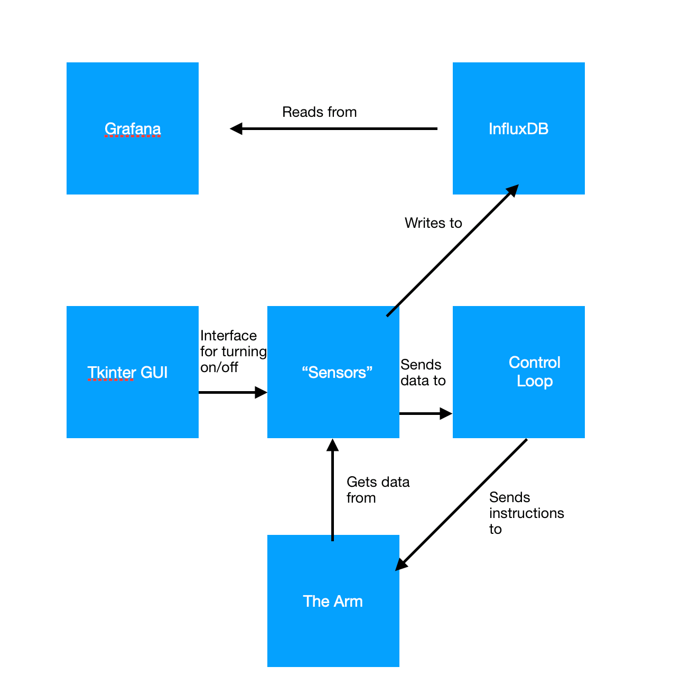

# RelativitySpaceHW

## Installation Instructions

This installation assumes you are installing on a Linux system. 

Install InfluxDB using these instructions: https://docs.influxdata.com/influxdb/v1.7/introduction/installation/

Install Grafana using these instructions: https://grafana.com/grafana/download 

Ensure you have python3 installed. 

Ensure you have the following python modules installed: 
tkinter
InfluxDBClient

Start InfluxDB instance: 
influxd

Start the Grafana server: systemctl start grafana-server 
Log in using default username/password: admin / admin  
Set up Grafana to read from InfluxDB, with database 'robot\_sim" 
Create a new dashboard.   
Create the following queries:  
select pos from y\_pos 
select cmd from y\_move\_cmd 

Click the dropdown at the bottom of the query to change to "table" mode.  
Also go to the visualization tab in the far left and change from "graph" to "table".

## Running Instructions

Clone the repository. 

Type 'python3 hw.py' into your terminal. 

You should see a window pop up with a button to start / stop the sensors. 
Click this button and you will see the results in Grafana. 

## Design Diagram

## Where this repository needs improvement

* Threading and multiprocessing without global variables. That, is processes should talk to each 
other like adults, without using global variables. 
* Sensor redundancy. Surely you wouldn't build a system like this without sensor redundancy? At 
the very least add in a piezo electric sensor for contact detection or some encoders on the 
joints or a proximity sensor or a vibration sensor so you'd have multiple ways to know if you're 
welding at the right spot or not. 
* Kalman Filtering. This isn't so essential with a simple system like this but what if the 
sensors are actually noisy and like spewing crazy data? Well, you'd want to take that into 
account so you can get the real picture. 
* Smarter control loop. The only other control mechanism I know of is PID loops, so I'd 
suggest implementing one of those, but maybe that's not what we want here. 
* Smarter sensor shutdown. I've currently implemented it such that the control loop just ignores 
the sensor data if the sensors are down. That's not entirely correct, but there were some 
details that I wasn't sure about so I just left it at that.  

These are just a couple of ideas for major improvements to the system. I'm sure there's other 
things that could be tweaked in this code. 
